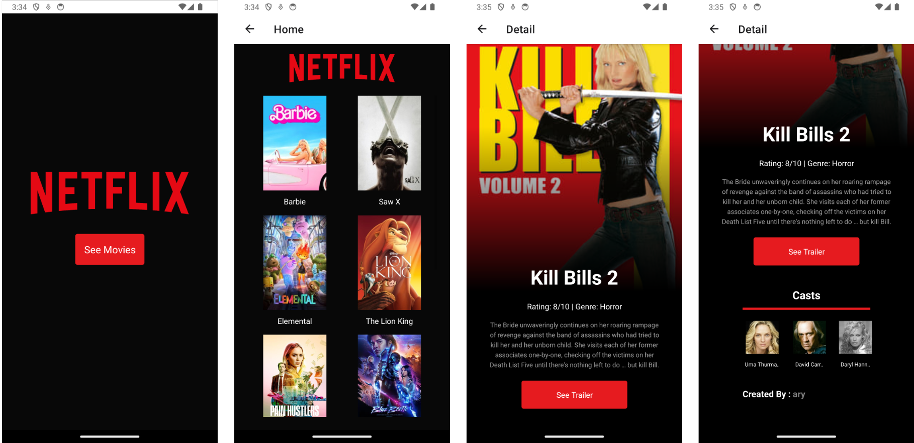

# MoviesApp-Mobile

- Public facing website for user to browse movies collection, and see movie detail
- Microservices to perform CRUD operation

### Tech Stack Used:

- Front-end: React Native, Apollo Client, Expo
- Back-end: ExpressJs, Sequelize, MongoDB, Docker, GraphQL, Apollo Server
- Deployment: AWS, Firebase

### Project Snippet:

### Link To Video:

https://drive.google.com/file/d/1IUGtHTWK4P7v614DmqYNlakyY7ybWqGd/view?usp=sharing
